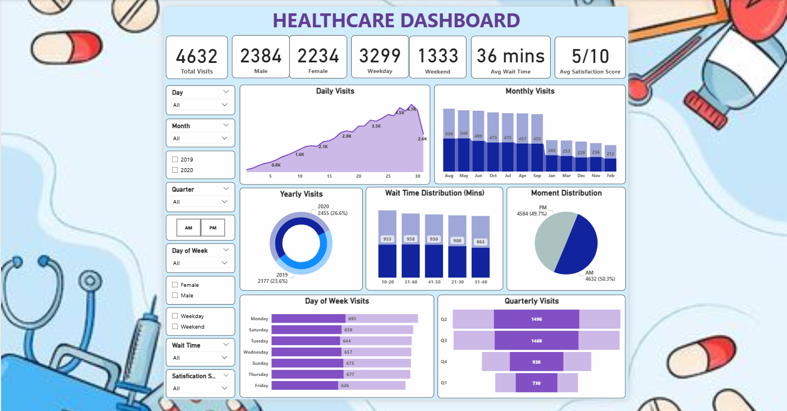
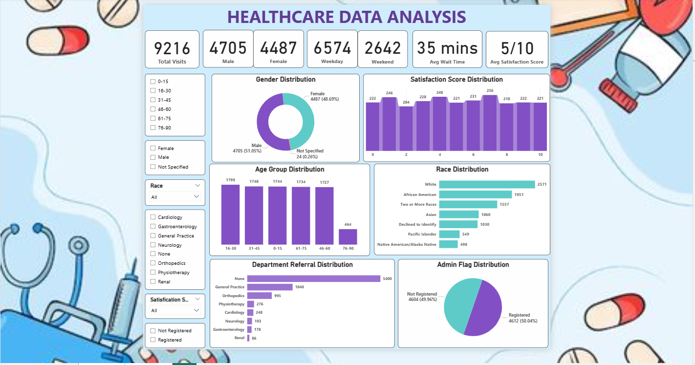

# 🏥 Healthcare Data Analysis using Power BI

An interactive **Healthcare Dashboard** built in **Power BI** to analyze hospital visitor trends, patient demographics, satisfaction levels, and departmental referrals.  
This project leverages **DAX, Power Query, and data modeling** to generate actionable insights for **better operational efficiency and improved patient care quality**.

---

## 📸 Dashboard Preview

  

---

## 📑 Table of Contents
- [Introduction](#-introduction)
- [Key Technologies and Skills](#-key-technologies-and-skills)
- [Features](#-features)
- [Contributing](#-contributing)
- [License](#-license)
- [Contact](#-contact)

---

## 📌 Introduction
This project focuses on analyzing healthcare data to reveal key insights such as **patient demographics, visit patterns, wait times, and satisfaction scores**.  

By combining **ETL processes, data modeling, and interactive visuals**, the dashboard empowers healthcare professionals to:
- Optimize resources  
- Improve patient satisfaction  
- Identify trends and patterns in hospital traffic  

---

## 🛠️ Key Technologies and Skills
- **Power BI** – Interactive dashboard creation  
- **Power Query Editor** – ETL (Extract, Transform, Load) process  
- **Data Analysis Expressions (DAX)** – Custom calculations and KPIs  
- **Excel** – Data preprocessing and integration  

---

## 🚀 Features

### 🔹 Data Understanding
- Patient demographics: Age, Gender, Race  
- Visit timings: Date, AM/PM, Weekday/Weekend  
- Hospital engagement: Referral departments, Satisfaction score  

### 🔹 Data Preprocessing
- ETL pipeline using **Power Query**  
- Missing value imputation and normalization  
- Relationship building for effective **data modeling**  

### 🔹 Visit Trends & Patterns
- Daily, Monthly, Quarterly & Yearly trends  
- Higher visits in **mid-year (Q2 & Q3)**  
- **5.8% increase** in visitors from 2019 to 2020  

### 🔹 Time-Based Insights
- Steady demand across **AM and PM visits**  
- Weekday visits **148% higher** than weekends  
- Peak visits on **Mondays & Wednesdays**  

### 🔹 Visitor Wait Time Analysis
- Avg wait time: **35 minutes**  
- **90.9% wait between 20-60 mins**  
- Improvement opportunities for reducing delays  

### 🔹 Demographic Insights
- Balanced age group visits, with fewer **75+** visitors  
- Racial diversity with majority **White & African American**  
- Male visitors **outnumber females by 4.8%**  

### 🔹 Satisfaction & Departmental Insights
- Avg satisfaction score: **5/10 (neutral)**  
- Top referrals: **General Practice & Orthopedics (30.7%)**  
- Non-referred patients: **58.6% of total visits**  

---

## 🤝 Contributing
Contributions are welcome!  
If you’d like to improve the dashboard, fix issues, or add new features:
1. Fork this repository  
2. Create a new branch (`feature/your-feature`)  
3. Commit your changes  
4. Submit a pull request  

---

## 📜 License
This project is licensed under the **MIT License** – feel free to use and modify with attribution.

---

## 📬 Contact
👤 **Mital Patil**  
📧 Email: patilmital4@gmail.com  

---
